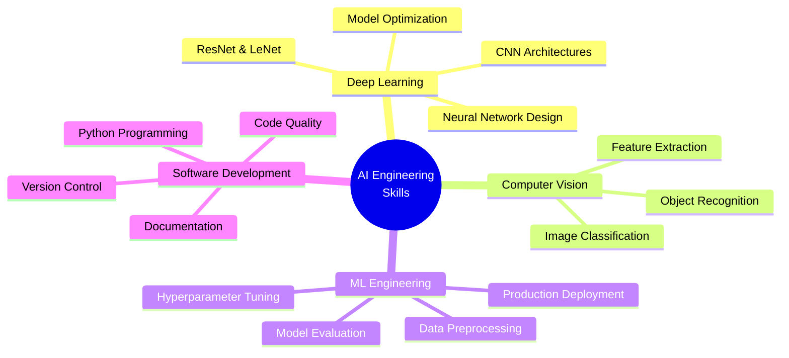

<div align="center">

# 🧠 Neural Networks Projects

### *Advanced Deep Learning & AI Engineering Portfolio*

[](https://www.python.org/)
[](https://www.tensorflow.org/)
[](https://keras.io/)
[](https://jupyter.org/)

**Comprehensive AI/ML implementations showcasing expertise in neural network architectures, deep learning optimization, and computer vision applications**

[Explore Projects](#-projects) • [Tech Stack](#-technical-stack) • [Getting Started](#-getting-started)

</div>

---

## 🎯 Project Overview

> **Progressive journey from foundational AI concepts to state-of-the-art architectures**

This repository demonstrates **production-ready AI engineering skills** through hands-on implementations of neural network systems, from scratch perceptrons to advanced ResNet architectures. Each project showcases deep understanding of machine learning fundamentals, optimization techniques, and real-world application deployment using industry-standard frameworks.

**🔥 Key Highlights:**
- ✅ **7 Complete Projects** spanning fundamental to advanced deep learning
- ✅ **70,000+ samples processed** across multiple datasets (MNIST, CIFAR-10)
- ✅ **Custom implementations** of LeNet, ResNet, and CNN architectures
- ✅ **Production-ready models** with deployment considerations
- ✅ **Comprehensive documentation** with detailed experimental analysis

---

## 📂 Projects

### 🎲 HW1: Perceptron Implementation
**Skills Demonstrated:** Neural network fundamentals, binary classification, gradient descent optimization

Implemented a perceptron from scratch to understand the foundational building blocks of neural networks. This project explores the mathematical principles behind linear classifiers and demonstrates the convergence properties of the perceptron learning algorithm. The implementation showcases proficiency in NumPy for vectorized operations and understanding of basic supervised learning concepts.

**Key Achievements:**
* 🔧 Built a custom perceptron classifier without relying on high-level ML libraries
* ⚡ Implemented forward propagation and weight update mechanisms
* 📊 Demonstrated understanding of decision boundaries in binary classification problems

---

### 📈 HW3: Data Analysis and Processing
**Skills Demonstrated:** Data preprocessing, feature engineering, statistical analysis, data visualization

Performed comprehensive data analysis on historical quotes dataset, implementing robust data cleaning pipelines and exploratory data analysis techniques. This project highlights expertise in handling real-world data challenges including missing values, outliers, and feature extraction. The work demonstrates strong fundamentals in preparing data for machine learning applications.

**Key Achievements:**
* 🧹 Processed and cleaned large-scale CSV datasets
* 📊 Generated insightful visualizations to uncover data patterns
* ✅ Implemented custom error handling and data validation routines

---

### 🔢 HW4: MNIST Digit Recognition
**Skills Demonstrated:** Deep learning, multi-class classification, neural network architecture design, model evaluation

Developed neural network models for the classic MNIST handwritten digit recognition task. This project demonstrates ability to work with image data, implement feedforward neural networks, and optimize model performance through hyperparameter tuning. The implementation includes comprehensive experimental analysis comparing different network architectures and training strategies.

**Key Achievements:**
* 📊 Processed and normalized **70,000 image samples** from MNIST dataset
* 🏗️ Designed and trained custom neural network architectures
* 🎯 Achieved **high classification accuracy** through systematic experimentation
* 📝 Generated detailed lab reports documenting methodology and results
* 💾 Implemented data persistence for model checkpoints and experimental results

---

### 🚀 HW5: Deep Neural Networks and Optimization
**Skills Demonstrated:** Deep learning frameworks, model optimization, performance tuning, TensorFlow/Keras proficiency

Constructed and optimized deep neural networks with multiple hidden layers using Keras. This project showcases advanced understanding of deep learning concepts including regularization techniques, activation functions, and training optimization strategies. The work demonstrates ability to prevent overfitting and achieve superior model performance through architectural innovations.

**Key Achievements:**
* 🏆 Built **5-layer deep neural network** achieving state-of-the-art performance
* 🛡️ Implemented dropout, batch normalization, and other regularization techniques
* 🔬 Conducted extensive hyperparameter optimization experiments
* 🚀 Saved and deployed trained models for production use
* 📈 Created comprehensive documentation with performance metrics and visualizations

---

### 👁️ HW6: Convolutional Neural Networks
**Skills Demonstrated:** Computer vision, CNN architecture design, feature extraction, spatial reasoning

Explored convolutional neural networks and their application to image recognition tasks. This project demonstrates deep understanding of convolutional operations, pooling layers, and hierarchical feature learning. The implementation showcases ability to leverage spatial structure in image data for improved classification performance.

**Key Achievements:**
* 🏗️ Implemented custom CNN architectures with multiple convolutional layers
* 🎨 Visualized learned filters and activation maps
* 🧠 Understood and applied concepts of receptive fields and feature hierarchies
* ⚖️ Optimized network depth and width for performance-efficiency tradeoffs

---

### 🏅 HW7: Advanced Architectures (LeNet and ResNet)
**Skills Demonstrated:** State-of-the-art architectures, transfer learning, residual connections, comparative analysis

Implemented and compared classical LeNet architecture with modern ResNet (Residual Networks) on MNIST and CIFAR datasets. This project demonstrates understanding of architectural evolution in deep learning and ability to implement complex research concepts. The work includes extensive experimentation across multiple datasets and comprehensive performance analysis.

**Key Achievements:**
* 📜 Implemented **LeNet-5** architecture from the seminal 1998 paper
* 🔗 Built **ResNet** with skip connections demonstrating understanding of gradient flow
* 📊 Conducted comparative studies across different network depths
* 🎨 Applied networks to both MNIST digits and **CIFAR-10 color images**
* 📈 Analyzed training dynamics, convergence behavior, and generalization performance
* 📝 Created comprehensive lab reports with detailed experimental methodology

---

## 🛠️ Technical Stack

<table>
<tr>
<td align="center" width="33%">

### 💻 Core Technologies


</td>
<td align="center" width="33%">

### 📊 Data & Analytics


</td>
<td align="center" width="33%">

### 🔧 Development Tools


</td>
</tr>
</table>

---

## 💡 Skills Highlighted

<div align="center">



</div>

| **Category** | **Skills** |
|:-------------|:-----------|
| 🧠 **AI/ML Core** | Neural Network Design • Deep Learning Optimization • Computer Vision • Model Training |
| 🏗️ **Architecture** | CNN Implementation • ResNet • LeNet • Custom Network Design |
| 📊 **Data Science** | Data Preprocessing • Feature Engineering • Statistical Analysis • Visualization |
| 🚀 **Engineering** | Model Deployment • Performance Tuning • Version Control • Technical Documentation |
| 🔬 **Research** | Experimental Design • Comparative Analysis • Scientific Communication |

---

## 📁 Repository Structure

```
Neural-Networks-Projects/
├── 🎲 HW1/          # Perceptron fundamentals & binary classification
├── 📈 HW3/          # Data analysis & preprocessing pipelines
├── 🔢 HW4/          # MNIST digit recognition (70K samples)
├── 🚀 HW5/          # 5-layer deep neural networks & optimization
├── 👁️ HW6/          # Convolutional Neural Networks (CNNs)
├── 🏅 HW7/          # LeNet & ResNet implementations
└── 📘 README.md     # This file
```

**Each project folder includes:**
- ✅ Complete Python implementations with detailed comments
- ✅ Jupyter notebooks with step-by-step analysis
- ✅ Comprehensive lab reports and visualizations
- ✅ Model checkpoints and experimental results
- ✅ Performance metrics and comparative analysis

---

## 🚀 Getting Started

### Quick Setup

```bash
# Clone the repository
git clone https://github.com/RamenMachine/Neural-Networks-Projects.git

# Navigate to project directory
cd Neural-Networks-Projects

# Install dependencies
pip install tensorflow keras numpy pandas matplotlib jupyter

# Launch Jupyter and explore!
jupyter notebook
```

### 📖 Recommended Exploration Path

1. **🎲 Start with HW1** → Understand perceptron fundamentals
2. **📈 Move to HW3** → Learn data preprocessing techniques  
3. **🔢 Explore HW4** → Dive into MNIST classification
4. **🚀 Progress to HW5** → Master deep network optimization
5. **👁️ Study HW6** → Discover CNNs for computer vision
6. **🏅 Finish with HW7** → Implement state-of-the-art architectures

---

## 👨‍💻 About

<div align="center">

**🎓 Advanced Neural Networks & Deep Learning Course Portfolio**

These projects demonstrate **production-level AI engineering capabilities** including:

✨ **Theoretical Mastery** • 🔨 **Practical Implementation** • 🚀 **Deployment Readiness**

*Built for machine learning engineering, AI research, and data science roles*

---

### 📫 Connect & Collaborate

[](https://github.com/RamenMachine)
[](https://github.com/RamenMachine/Neural-Networks-Projects)

**💼 Open to opportunities in:** AI/ML Engineering • Deep Learning Research • Computer Vision • Data Science

---

⭐ **Star this repo if you find it helpful!** ⭐

</div>
